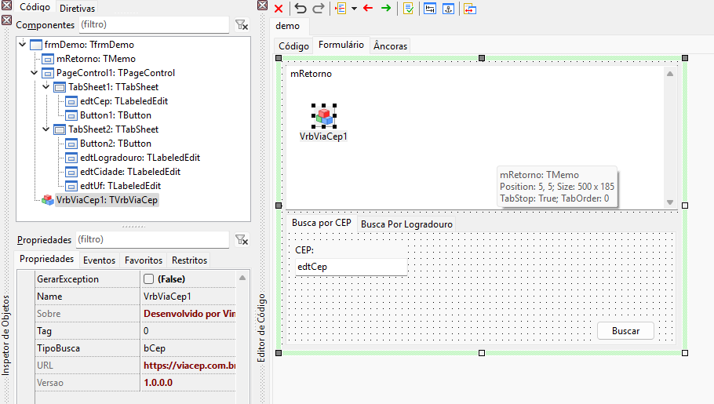
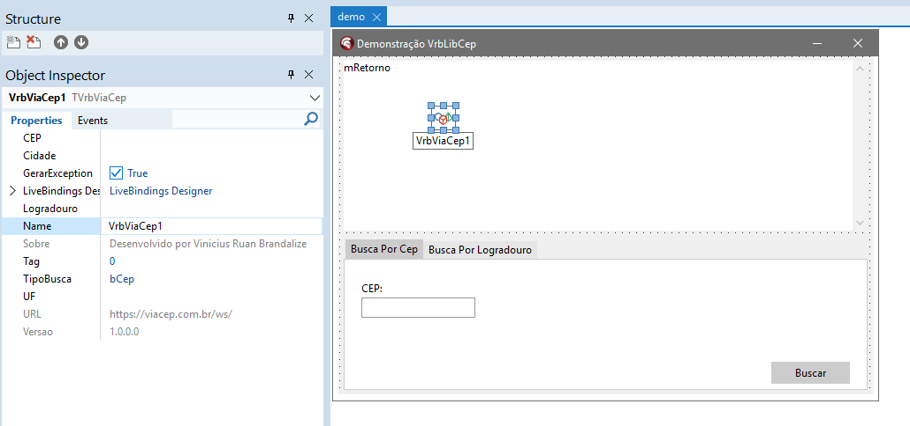

# VrbLibCep

Componente Delphi/Lazarus FPC para consulta de CEP, utilizando o webservice gratuito VIA CEP.

Obs.: Ao utilizar com o lazarus copiar as dlls (caso compile para windows) dentro da pasta do executavel:
"libcrypto-1_1.dll", "libiconv-2.dll", "libintl-8.dll", "libssl-1_1.dll"

Testado com o Lazarus v3.4 e Delphi 12.

Link da API ViaCep: https://viacep.com.br/